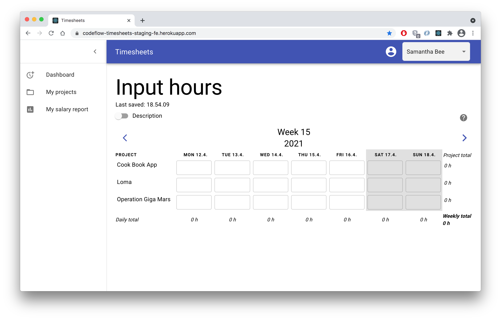
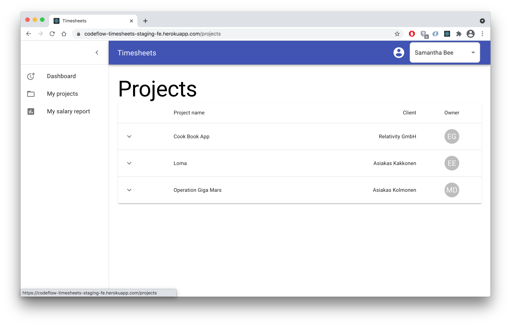
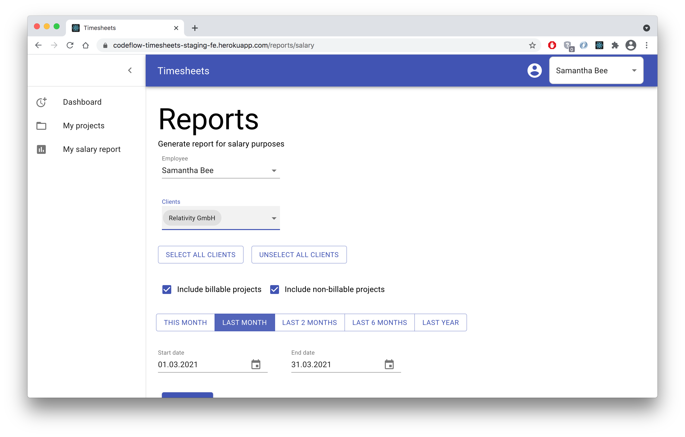
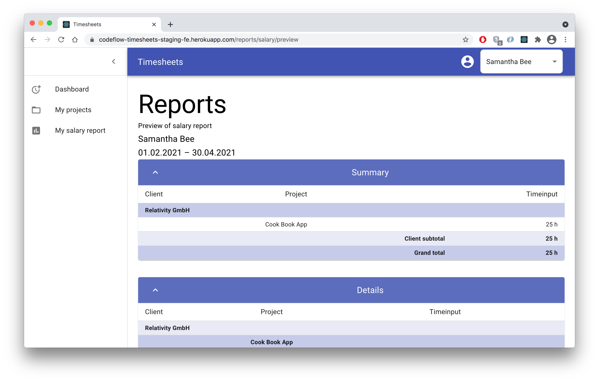

# Timesheets front-end

## About this project

Timesheets is an application for tracking work hours in customer projects and creating reports for billing and salary purposes.

This document describes the high-level architecture of Timesheets front-end.

## Architecture

Timesheets front-end is made with TypeScript and React and several other libraries for different purposes:

- Axios - HTTP client
- clsx - Conditional classnames construction
- date-fns - Date utility functions
- Formik - Forms
- i18next - Localisation
- just-debounce-it - Debounce
- Material UI - Component library and styles
- Mousetrap - Keyboard shortcuts
- qs - HTTP request querystring parsing and stringifying
- Recoil - State management

All the components have been for the most part grouped by features such as dashboard, project, report. There are some general components (Button, Form) that are used across other components.

The application uses Jest and React Testing Library for unit testing. All unit tests are located in the same folder as the component under test. testUtils contains helper functions and data for tests. Cypress is used for E2E testing and Cypress test files are in cypress directory in project root.

Code quality and adherance to coding standards is ensured with Eslint with Airbnb configuration and Prettier. Their configuration files can be found in project root.

## How to build and run this project

- Install the back-end. [Read instructions here](<!-- TODO: add link -->)

- Install yarn package manager. (MacOS: `brew install yarn`)

- Clone this repo.

- Execute `yarn install`

- Run the project: `yarn start`

- All other scripts can be found in [README.md](./README.md) or [package.json](./package.json)

## How to run tests

- Run unit tests: `yarn test`

- Run cypress tests:

  - Cypress test should be run agains local back-end to avoid creating test data in the production data base.
  - Run the project first with `yarn start`
  - Then run cypress test in another terminal with `yarn cypress run` or `yarn cypress open` (GUI version).

## Website Pages

### Dashboard

### Projects View

### Reports

